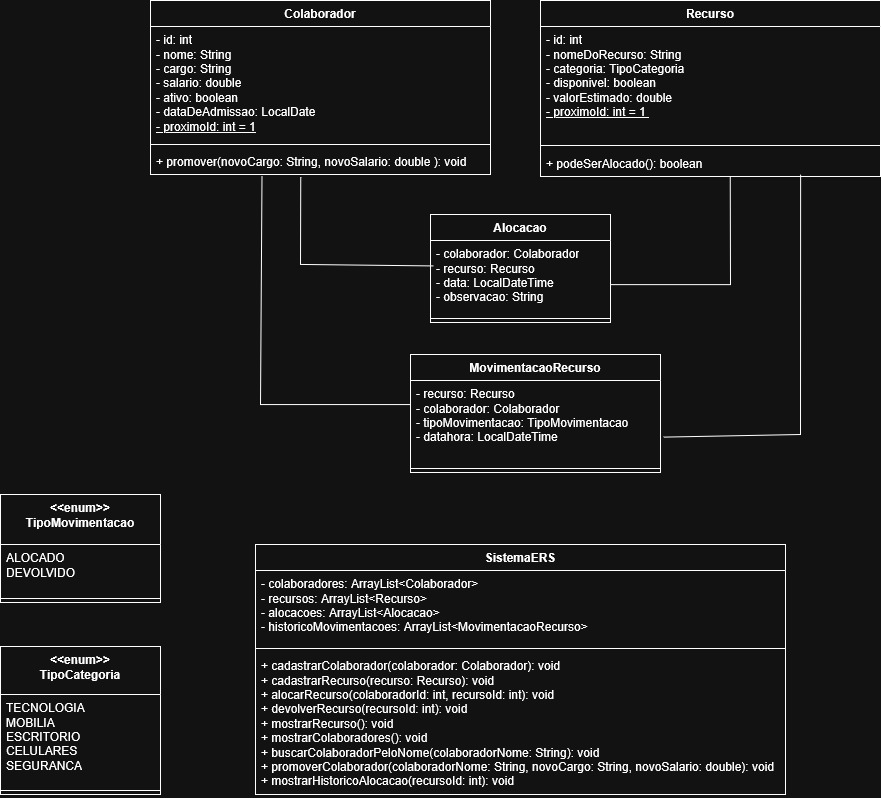

# ERS — Employee Resource System

## 📌 Contexto Empresarial
Em empresas de tecnologia, bancos, hospitais, indústrias e consultorias, existe a necessidade de controlar de forma eficiente **colaboradores, equipamentos e recursos internos**.

Este projeto representa o **núcleo inicial do domínio corporativo de gestão de recursos**, permitindo o cadastro e a movimentação de ativos utilizados por colaboradores.

O sistema foi desenvolvido utilizando **conceitos fundamentais de Java Orientado a Objetos**, sem uso de frameworks ou banco de dados, simulando um primeiro módulo que futuramente poderia integrar áreas como:
RH, Facilities, Segurança, Compras, Operações, Financeiro

---

## 🎯 Objetivo do Projeto
Desenvolver o primeiro módulo funcional do **ERS (Employee Resource System)** com foco em:

- Cadastro de colaboradores
- Cadastro de recursos corporativos
- Alocação de recursos
- Devolução de recursos
- Busca de colaboradores
- Controle de disponibilidade
- Histórico de movimentações

---

## 🧱 Diagrama de classes

---

## ⚙️ Regras de Negócio Implementadas

### 👤 Colaborador
- Todo colaborador recém-cadastrado inicia com `ativo = true`
- IDs gerados automaticamente
- Possibilidade de promoção com alteração de cargo e salário

### 💻 Recurso
- Todo recurso inicia como disponível
- IDs gerados automaticamente
- Recursos acima de **R$ 5000,00** exigem autorização especial
- Recursos indisponíveis não podem ser alocados

### 📦 Alocação
- Um recurso só pode ser alocado se estiver disponível
- Ao alocar:
  - status muda para indisponível
  - movimentação é registrada
- Ao devolver:
  - status volta para disponível
  - alocação ativa é removida
  - devolução é registrada no histórico

---

## 💡 Inovação Implementada

### 🕘 Histórico de movimentações do recurso
Como diferencial corporativo, foi implementado um **histórico completo de movimentações**, permitindo auditoria do ciclo de vida do ativo.

Cada movimentação registra:
- recurso
- colaborador responsável
- tipo da movimentação
- data e hora

Tipos de movimentação implementados com `enum`:
- `ALOCADO`
- `DEVOLVIDO`

Esse histórico simula práticas reais de empresas para:
- rastreabilidade
- auditoria
- governança
- segurança patrimonial

---

## 🚀 Melhorias Técnicas Aplicadas
Além do enunciado, o projeto recebeu melhorias de arquitetura:

- Uso de **Enums** para categorias de recurso
- Uso de **Enums** para tipos de movimentação
- Organização em **pacotes** (`model`, `service`, `ui`, `enums`, `main`)
- Associação entre objetos em `Alocacao`
- Geração automática de IDs
- Validação de entradas no menu com `try-catch`
- Submenu dinâmico para categorias

---

## 🏢 Inspiração no Mundo Corporativo
A modelagem foi inspirada em práticas reais de gestão de ativos empresariais:

- inventário de notebooks e celulares
- controle de empréstimos internos
- rastreamento de equipamentos
- políticas de segurança para ativos de alto valor
- histórico de uso por colaborador
- apoio a onboarding e movimentações internas

---

## ▶️ Como Executar
1. Abrir o projeto no IntelliJ
2. Executar a classe `Main`
3. Utilizar o menu interativo no terminal

---

## 🏁 Resultado
O projeto entrega um **módulo funcional, extensível e aderente ao contexto empresarial**, servindo como base para futuras evoluções, como:

- persistência em banco de dados
- autenticação
- autorização por perfil
- dashboard gerencial
- integração com RH
- relatórios financeiros

---

## 👩‍💻 Autores
Ana Clara Oliveira 
Kaike Souza 
Kauã Silva 
Vitor Alcantara 
Vitor Fernandes 

